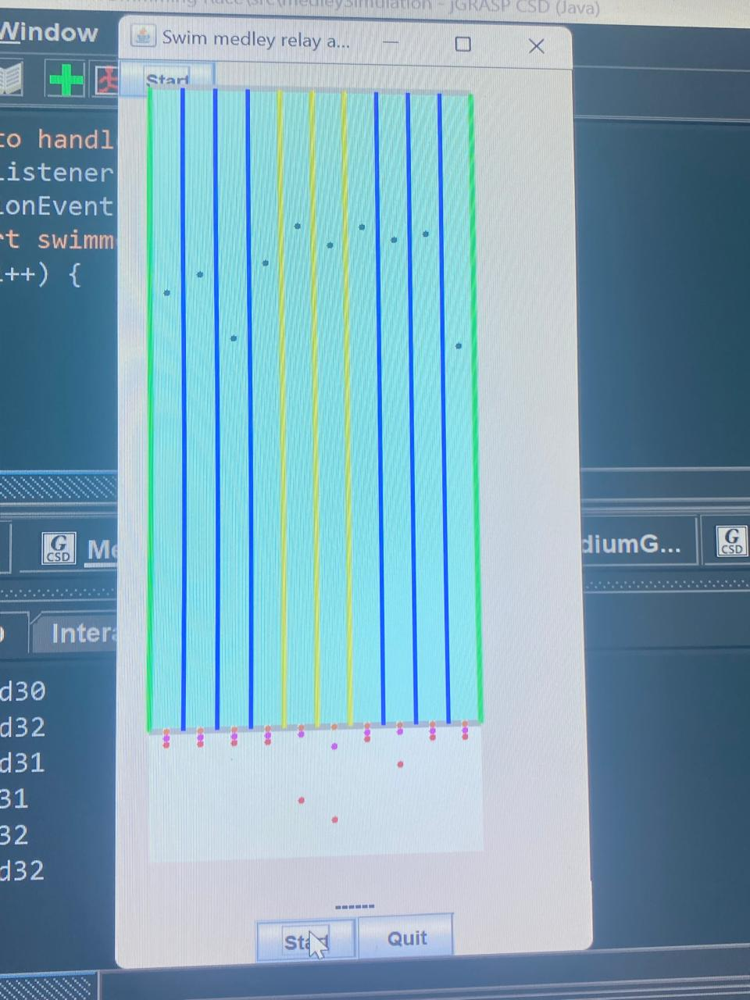

  

<h3 align="center">Multithreaded Concurrent Swimming Race</h3>

---

This project simulates a Multithreaded Swimming Race, where swimmers compete in a race using threading to manage concurrency. Each swimmer is represented as a thread, and they race across a pool, updating their progress dynamically. The goal of the project is to demonstrate multithreading and concurrency concepts.

      

- [About](#about)
- [Prerequisites](#prerequisites)
- [Installing](#installing)
- [Running the Application](#tests)
- [Usage](#usage)
- [built_using](#built_using)
- [Authors](#authors)

## 🧐 About 
The simulation of the swim medley enforces strict rules regarding swimmer order, race transitions,
and synchronized starting conditions. Each swim team consists of four swimmers, and they must
swim in a specific sequence according to the medley relay order (Backstroke, Breaststroke,
Butterfly, and Freestyle). The team-based synchronization is designed to ensure that the next
swimmer can only start their section after the previous swimmer has completed theirs.
Additionally, no swimmer can dive into the pool until all team members have reached their starting
blocks, enforcing both fairness and proper race conditions.

The simulation begins when the user presses the Start button.
Swimmers then enter through the entrance door one by one in the order of their swim stoke,
proceed to line up at the starting block, then swim their 100m of the the race as a relay
(swimmers start only after their previous teammate has finished): each swimmer swims to the
end of the 50m pool and back. Once they have finished their 100m, swimmers exit the pool
and stand at the back of the stadium, except for the last member of the team, who stays in the
pool once done.

## Prerequisites 

GNU Make:
Linux: Pre-installed on most distributions; install using your package manager if missing.
Windows: Install using one of the methods below.
Required Dependencies: Refer to the Dependencies section.
Python (if the project uses Python): Ensure it is installed and available in your system's PATH.

### Installing 

1. Verify <b>make<b> is installed
2. Navigate to the project folder
3. Execute Make Run

## 🔧 Running the application 

## 🎈 Usage 

Just a simple make run command 
Click start and the swimmers should start

OR

Open the project in a Java IDE such as IntelliJ IDEA or Eclipse.
Ensure the JDK (Java Development Kit) is installed.
Compile and run the main program.
The console will display the swimming race's progress and results.

## ⛏️ Built Using 

- Java
- Multithreading (Thread and Runnable)
- Concurrency Utilities
- Swing

## ✍️ Authors 

- Blessing Hlongwane
